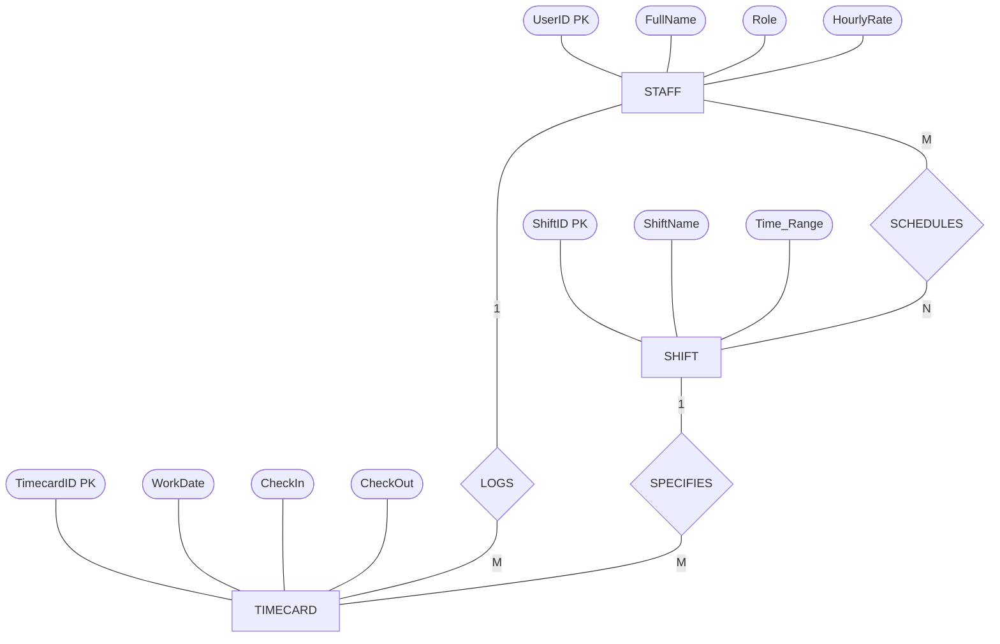

# Mô hình thực thể liên kết (ERD)

Dưới đây là sơ đồ ERD của dự án, được vẽ tự động bằng Mermaid. GitHub hỗ trợ hiển thị trực tiếp biểu đồ này.

```mermaid
flowchart TD
    %% Entities
    STAFF[STAFF]
    SHIFT[SHIFT]
    TIMECARD[TIMECARD]

    %% Relationships
    SCHEDULES{SCHEDULES}
    LOGS{LOGS}
    SPECIFIES{SPECIFIES}

    %% Attributes for STAFF
    UserID([UserID PK])
    FullName([FullName])
    Role([Role])
    HourlyRate([HourlyRate])

    %% Attributes for SHIFT
    ShiftID([ShiftID PK])
    ShiftName([ShiftName])
    TimeRange([Time_Range])

    %% Attributes for TIMECARD
    TimecardID([TimecardID PK])
    WorkDate([WorkDate])
    CheckIn([CheckIn])
    CheckOut([CheckOut])

    %% Connect STAFF Attributes
    UserID --- STAFF
    FullName --- STAFF
    Role --- STAFF
    HourlyRate --- STAFF

    %% Connect SHIFT Attributes
    ShiftID --- SHIFT
    ShiftName --- SHIFT
    TimeRange --- SHIFT

    %% Connect TIMECARD Attributes
    TimecardID --- TIMECARD
    WorkDate --- TIMECARD
    CheckIn --- TIMECARD
    CheckOut --- TIMECARD

    %% Connect Relationships (with cardinality)
    STAFF ---|M| SCHEDULES
    SCHEDULES ---|N| SHIFT

    STAFF ---|1| LOGS
    LOGS ---|M| TIMECARD

    SHIFT ---|1| SPECIFIES
    SPECIFIES ---|M| TIMECARD
```
